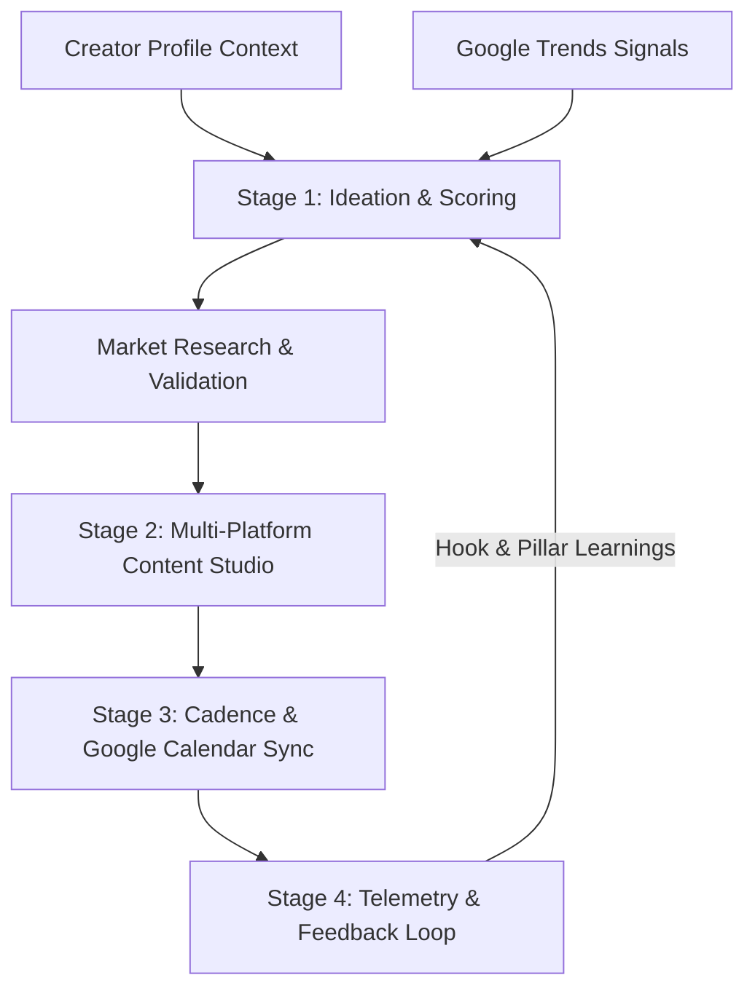

# KindCrew — Autonomous AI Creator Studio

KindCrew is an end-to-end autonomous content creation and distribution platform engineered for modern creators. Built on Next.js 16, Express 5, AWS Bedrock (Claude 3.5 Sonnet), AWS DynamoDB, and Amazon Cognito, KindCrew eliminates creator block by transforming raw ideas into market-validated, platform-native content with deterministic voice grounding.

---

## 📋 Table of Contents

- [Overview](#overview)
- [Key Features](#key-features)
  - [Currently Implemented](#currently-implemented)
  - [Planned Capabilities](#planned-capabilities)
- [System Architecture](#system-architecture)
- [Repository Structure](#repository-structure)
- [Authentication Architecture](#authentication-architecture)
- [Creator Profile & Deterministic Grounding](#creator-profile--deterministic-grounding)
- [Ideation Engine](#ideation-engine)
- [Multi-Platform Content Studio](#multi-platform-content-studio)
- [Data & Cloud Infrastructure](#data--cloud-infrastructure)
- [Environment Configuration](#environment-configuration)
- [Quick Start & Local Development](#quick-start--local-development)
- [Testing & Verification](#testing--verification)
- [Production Build](#production-build)
- [Critical Architecture Invariants](#critical-architecture-invariants)
- [Troubleshooting](#troubleshooting)
- [Author & License](#author--license)

---

## 🎯 Overview

High-output creators often face friction across fragmented workflows: uncalibrated AI prompts, guesswork on topic virality, manual platform reformatting, and irregular publishing cadences.

KindCrew solves this with a **4-stage interconnected operating loop**:
1. **Stage 1: Trend-Backed Ideation & Scoring** — Surface trending keywords via Google Trends, validate concepts through 3 distinct pathways, and calculate predictive virality scores.
2. **Stage 2: Adaptive Multi-Platform Studio** — Draft platform-tailored copy (LinkedIn, Twitter / X, Instagram, YouTube) grounded in creator profile parameters.
3. **Stage 3: Cadence Planning & Calendar Sync** — Queue and schedule distribution across optimal time slots with Google Calendar synchronization.
4. **Stage 4: Performance Telemetry & Feedback** — Track engagement metrics and feed high-performing hook patterns directly back into the next ideation cycle.



---

## ✨ Key Features

### Currently Implemented

- **Dual Authentication & Account Linking**:
  - Google OAuth login and email/password login via Amazon Cognito.
  - Seamless bidirectional account linking (Google ↔ Password) preserving canonical `User.userId` and `CreatorProfile`.
  - Secure session restoration with automatic silent token refresh via HTTP-only cookies.
- **Deterministic Creator Context**:
  - Comprehensive creator profile modeling: Niche, Target Audience, Content Pillars, Tone, Formality, CTA Strength, and Avoided Topics.
  - Profile parameters injected directly into AWS Bedrock system prompts to guarantee voice fidelity.
- **3 Ideation Pathways**:
  - *Zero Idea*: Synthesize 10 structured concepts from your creator niche.
  - *Refine Rough Concept*: Transform an unpolished 1-sentence thought into 5 strategic angles.
  - *Evaluate Pitch*: Diagnostic scorecard computing Virality, Clarity, and Competitive Saturation (0–10 scale).
- **Deep Market Research & Blueprints**:
  - Synthesize audience pain points, proven competitor patterns, strategic angle advantages, and outline flows.
- **Multi-Platform Content Studio**:
  - Autonomous generation of LinkedIn posts, multi-tweet threads, Instagram carousels/captions, and YouTube video scripts.
  - Rich Markdown rendering (`**bold**`, bulleted lists, hook callouts) across all drafts and ideas.
- **Cadence Planning & Calendar**:
  - Interactive calendar interface for scheduling publication dates and managing distribution queues.
- **Performance Analytics**:
  - Key performance indicator cards (Impressions, Engagement Velocity, Top Content Pillars) and AI diagnostic recommendations.
- **Dark Aesthetic Design System**:
  - High-end dark charcoal theme (`#000000`, `#09090b`, `#18181b`) with amber accents (`#f59e0b`), React Bits interactive elements, and zero emoji clutter.

### Planned Capabilities

- Automated direct social media publishing via native platform APIs.
- Video generation and thumbnail rendering integrations.
- Multi-creator team workspaces with role-based access control.

---

## 🏗️ System Architecture

```
┌────────────────────────────────────────────────────────┐
│              Next.js 16 Frontend (App Router)          │
│   Tailwind CSS v4 • Zustand Store • React Markdown     │
└───────────────────────────┬────────────────────────────┘
                            │ HTTPS / REST (Credentials)
┌───────────────────────────▼────────────────────────────┐
│              Node.js Express 5 API Gateway             │
│   Auth Middleware (JWKS Verifier) • Session Manager    │
├───────────────────────────┬────────────────────────────┤
│  Modules & Controllers:   │  Backend Services:         │
│  - Auth & Cognito Link    │  - BedrockService (Claude) │
│  - CreatorProfile         │  - GoogleTrendsService     │
│  - IdeationEngine         │  - GoogleCalendarService   │
│  - ContentStudio          │  - SES / Nodemailer        │
│  - Scheduling & Analytics │  - EventBridge Scheduler   │
└───────────────────────────┬────────────────────────────┘
                            │ AWS SDK v3
┌───────────────────────────▼────────────────────────────┐
│                  AWS Cloud Infrastructure              │
│  Amazon Bedrock • DynamoDB • Cognito User Pool         │
└────────────────────────────────────────────────────────┘
```

---

## 📁 Repository Structure

```
AI-For-Bharat_KindCrew/
├── backend/
│   ├── config/              # Database & Express configuration
│   │   ├── app.js           # Express app instance (legacy entry)
│   │   ├── cognito.js       # AWS Cognito Client SDK
│   │   └── dynamodb.js      # AWS DynamoDB DocumentClient SDK
│   ├── controllers/         # Request handlers
│   │   ├── authController.js
│   │   ├── creatorProfileController.js
│   │   ├── ideationController.js
│   │   └── contentController.js
│   ├── middleware/          # Security, auth verification, error handling
│   │   ├── authMiddleware.js
│   │   └── errorHandler.js
│   ├── models/              # DynamoDB entity schemas & access layers
│   │   ├── User.js
│   │   ├── CreatorProfile.js
│   │   ├── ContentIdea.js
│   │   ├── ContentDraft.js
│   │   └── ScheduledPost.js
│   ├── routes/              # Express API route declarations
│   ├── services/            # Core business integrations
│   │   ├── bedrock.service.js
│   │   ├── cognitoService.js
│   │   ├── googleTrendsService.js
│   │   ├── googleCalendarService.js
│   │   └── ses.service.js
│   ├── src/                 # Primary backend entrypoint
│   │   ├── app.js
│   │   └── server.js
│   ├── tests/               # Node test suite (68 automated unit & IDOR tests)
│   └── package.json
│
├── frontend/
│   ├── public/              # Static assets and icons
│   ├── src/
│   │   ├── app/             # Next.js App Router routes
│   │   │   ├── page.tsx     # Landing page (Bento layout, Hero, Navbar, Footer)
│   │   │   ├── dashboard/   # Creator dashboard & calendar planning
│   │   │   ├── ideation/    # 3 Ideation pathways & research validation
│   │   │   ├── content/     # Multi-platform content studio & library
│   │   │   ├── analytics/   # Growth telemetry dashboard
│   │   │   ├── profile/     # Creator identity overview
│   │   │   └── settings/    # Tabbed settings (Tone, Strategy, Security)
│   │   ├── components/      # Modular React UI components
│   │   │   ├── landing/     # Landing page components (Hero, BentoFeatures, etc.)
│   │   │   ├── settings/    # Settings tab components & modals
│   │   │   └── ui/          # Primitives (MarkdownRenderer, Badge, Skeleton, etc.)
│   │   ├── hooks/           # Custom React hooks (useAuth, useIdeation, etc.)
│   │   ├── lib/             # API client, constants, user utilities
│   │   └── store/           # Zustand state slices (Auth, Profile, Content, Ideation)
│   └── package.json
│
├── docs/                    # Architectural design & requirements documents
├── context.md               # Development checkpoints and security invariants
└── README.md                # Project documentation and onboarding guide
```

---

## 🔐 Authentication Architecture

KindCrew enforces strict identity management through Amazon Cognito:

1. **Canonical User Identity**:
   - The primary application key is `User.userId`.
   - Every `CreatorProfile`, `ContentIdea`, and `ContentDraft` belongs to this canonical `userId`.
2. **Bidirectional Account Linking**:
   - Users can link Google OAuth and Password login methods in either order.
   - When linked, both authentication providers resolve to the same underlying KindCrew `userId`.
3. **Session Integrity**:
   - Backend sets secure, HTTP-only session cookies (`kindcrew-session-token`).
   - Client requests include `credentials: "include"` for transparent authorization.
4. **IDOR & Ownership Protection**:
   - API endpoints resolve `userId` server-side from `req.auth.userId`.
   - Client-provided `userId` parameters in request bodies are ignored.

---

## ⚙️ Environment Configuration

### Backend (`backend/.env`)

Copy `backend/.env.example` to `backend/.env` and supply your actual credentials:

```env
PORT=5000
NODE_ENV=development
FRONTEND_URL=http://localhost:3000
SESSION_SECRET=your-session-secret-at-least-32-chars-long

# AWS Credentials
AWS_REGION=us-east-1
AWS_ACCESS_KEY_ID=your-aws-access-key-id
AWS_SECRET_ACCESS_KEY=your-aws-secret-access-key

# Amazon Cognito
COGNITO_USER_POOL_ID=your-cognito-user-pool-id
COGNITO_CLIENT_ID=your-cognito-client-id
COGNITO_CLIENT_SECRET=your-cognito-client-secret
COGNITO_DOMAIN=your-cognito-domain.auth.us-east-1.amazoncognito.com
COGNITO_CALLBACK_URL=http://localhost:5000/api/auth/cognito/callback
COGNITO_SIGNOUT_REDIRECT_URI=http://localhost:3000

# DynamoDB Tables
DYNAMODB_TABLE_USERS=Users
DYNAMODB_TABLE_CREATOR_PROFILES=CreatorProfiles
DYNAMODB_TABLE_IDEAS=ContentIdeas
DYNAMODB_TABLE_CONTENT=ContentDrafts
DYNAMODB_TABLE_SCHEDULED_POSTS=ScheduledPosts

# Amazon Bedrock
BEDROCK_MODEL_ID=anthropic.claude-3-5-sonnet-20241022-v2:0

# Email Delivery (SMTP / Nodemailer)
SMTP_USER=your-smtp-email@gmail.com
SMTP_PASS=your-smtp-app-password
SMTP_FROM="KindCrew <no-reply@kindcrew.com>"
```

### Frontend (`frontend/.env.local`)

Copy `frontend/.env.example` to `frontend/.env.local`:

```env
NEXT_PUBLIC_API_URL=http://localhost:5000
NEXT_PUBLIC_APP_URL=http://localhost:3000
```

---

## 🚀 Quick Start & Local Development

### Prerequisites

- **Node.js**: `v18.0.0` or higher
- **npm**: `v9.0.0` or higher
- **AWS Account** with DynamoDB, Cognito User Pool, and Bedrock model access.

### Step-by-Step Setup

1. **Clone the Repository**:
   ```bash
   git clone https://github.com/vedrathavi/AI-For-Bharat_KindCrew.git
   cd AI-For-Bharat_KindCrew
   ```

2. **Install Backend Dependencies**:
   ```bash
   cd backend
   npm install
   ```

3. **Install Frontend Dependencies**:
   ```bash
   cd ../frontend
   npm install
   ```

4. **Initialize Environment Files**:
   - Create `backend/.env` from `backend/.env.example`.
   - Create `frontend/.env.local` from `frontend/.env.example`.

5. **Start the Development Servers**:
   - **Terminal 1 (Backend)**:
     ```bash
     cd backend
     npm run dev
     ```
     Backend starts on `http://localhost:5000`.
   - **Terminal 2 (Frontend)**:
     ```bash
     cd frontend
     npm run dev
     ```
     Frontend starts on `http://localhost:3000`.

---

## 🧪 Testing & Verification

KindCrew includes a suite of 68 automated unit, integration, and security tests covering token verification, account linking, IDOR defenses, and profile management:

```bash
# Run backend test suite
cd backend
npm test
```

Expected Output:
```
# tests 68
# pass 68
# fail 0
```

---

## 📦 Production Build

To test and compile the production bundle for deployment:

```bash
# Compile frontend production bundle
cd frontend
npm run build
```

Next.js will generate static and server-rendered routes with 0 TypeScript/Turbopack errors across all 20 application routes.

---

## 🔒 Critical Architecture Invariants

When contributing to KindCrew, **never violate the following security invariants**:

1. **Identity Isolation**: Never trust a `userId` supplied in a client request body. Always read `req.auth.userId` attached by `authMiddleware.js`.
2. **Canonical Account Linking**: Google and Password logins must always resolve to the same underlying `User.userId` record.
3. **CreatorProfile Idempotency**: Duplicate profile creations must resolve idempotently without overwriting existing profile data.
4. **Secure Markdown Rendering**: All AI outputs and user-generated text must be parsed through `<MarkdownRenderer />` to sanitize and properly render formatting without XSS risks.
5. **No Secrets in Source Control**: Never commit `.env` or `.env.local` files containing real API credentials.

---

## 🛠️ Troubleshooting

- **Google OAuth Conflict**: If an email is registered with password credentials and you attempt to sign in with Google without linking, the system prompts you to log in with your password and connect Google via **Settings → Security**.
- **Bedrock Model Access Error**: Ensure that Claude 3.5 Sonnet is enabled in your AWS Bedrock Model Access console in the configured `AWS_REGION`.
- **CORS / Session Cookie Mismatch**: Verify that `FRONTEND_URL` in `backend/.env` matches the origin of your frontend (`http://localhost:3000`).

---

## 👤 Author & Open Source

- **Author**: [Ved Rathavi](https://github.com/vedrathavi)
- **Repository**: [https://github.com/vedrathavi/AI-For-Bharat_KindCrew](https://github.com/vedrathavi/AI-For-Bharat_KindCrew)
- **Initiative**: AI for Bharat
